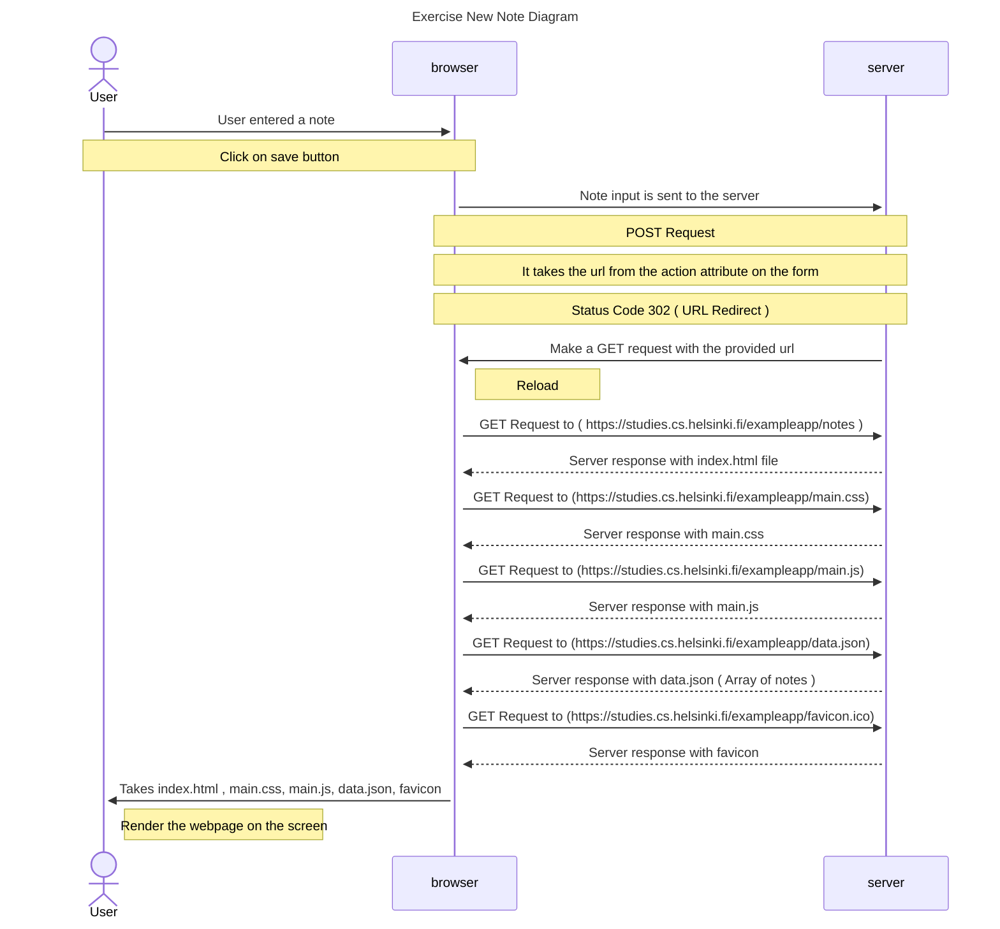

```mermaid
sequenceDiagram
title Exercise New Note Diagram
actor User
participant browser
participant server


    User->>+browser: User entered a note
    Note over User,browser: Click on save button
    browser->>+server: Note input is sent to the server
    Note over browser,server: POST Request
    Note over browser,server: It takes the url from the action attribute on the form
    Note over browser,server: Status Code 302 ( URL Redirect )
    server->>+browser: Make a GET request with the provided url
    Note right of browser: Reload
    browser->>+server: GET Request to ( https://studies.cs.helsinki.fi/exampleapp/notes )
    server-->>browser: Server response with index.html file
    browser->>+server: GET Request  to (https://studies.cs.helsinki.fi/exampleapp/main.css)
    server-->>browser: Server response with main.css
    browser->>+server: GET Request  to (https://studies.cs.helsinki.fi/exampleapp/main.js)
    server-->>browser: Server response with main.js
    browser->>+server: GET Request  to (https://studies.cs.helsinki.fi/exampleapp/data.json)
    server-->>browser: Server response with data.json ( Array of notes )
    browser->>+server: GET Request  to (https://studies.cs.helsinki.fi/exampleapp/favicon.ico)
    server-->>browser: Server response with favicon
    browser->>+User: Takes index.html , main.css, main.js, data.json, favicon
    Note right of User: Render the webpage on the screen

```
