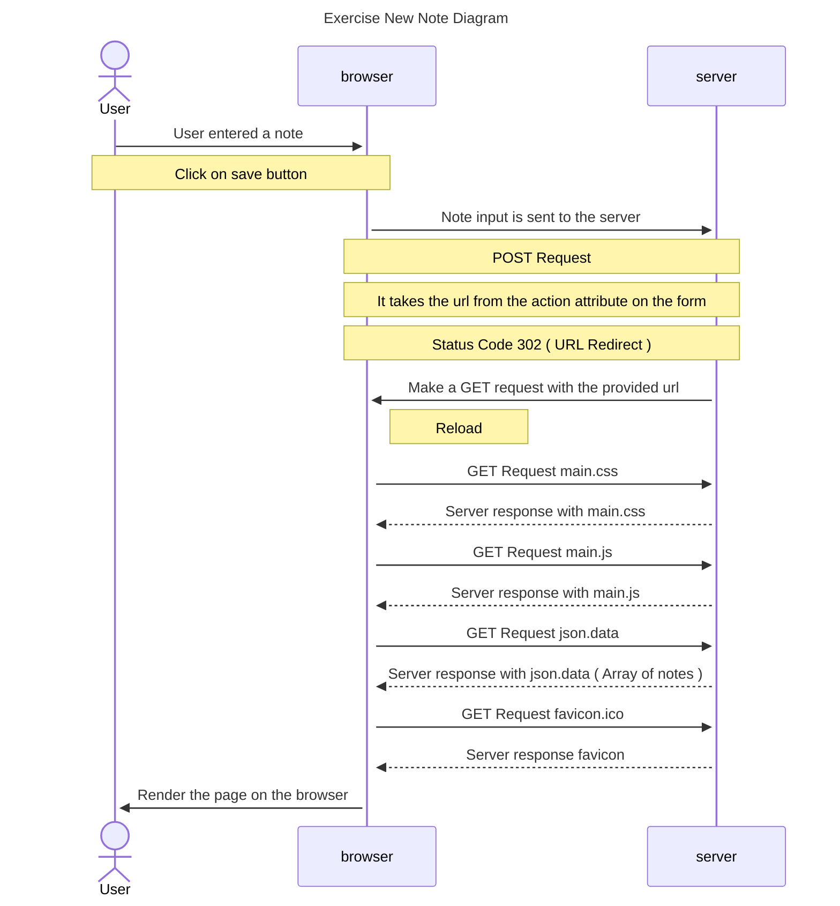

```mermaid
sequenceDiagram
title Exercise New Note Diagram
actor User
participant browser
participant server


    User->>+browser: User entered a note
    Note over User,browser: Click on save button
    browser->>+server: Note input is sent to the server
    Note over browser,server: POST Request
    Note over browser,server: It takes the url from the action attribute on the form
    Note over browser,server: Status Code 302 ( URL Redirect )
    server->>+browser: Make a GET request with the provided url
    Note right of browser: Reload
    browser->>+server: GET Request  main.css
    server-->>browser: Server response with main.css
    browser->>+server: GET Request main.js
    server-->>browser: Server response with main.js
    browser->>+server: GET Request json.data
    server-->>browser: Server response with json.data ( Array of notes )
    browser->>+server: GET Request favicon.ico
    server-->>browser: Server response favicon
    browser->>+User: Render the page on the browser

```
