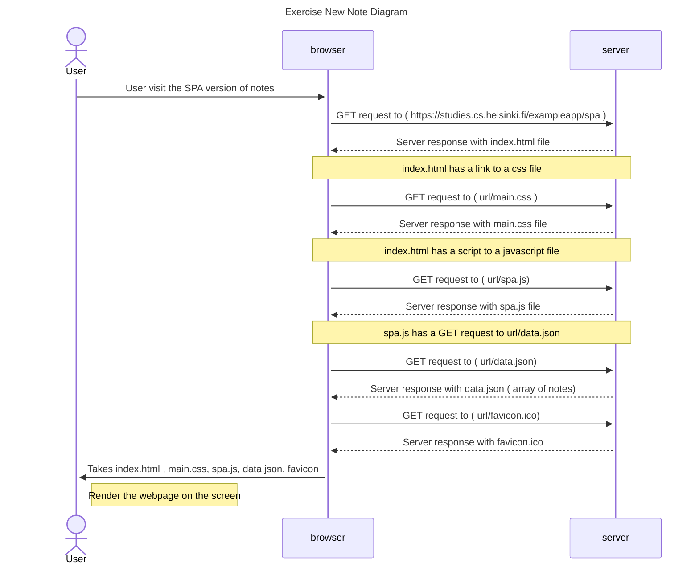

```mermaid
sequenceDiagram
title Exercise New Note Diagram
actor User
participant browser
participant server

    User->>+browser: User visit the SPA version of notes

    browser->>+server: GET request to ( https://studies.cs.helsinki.fi/exampleapp/spa )
    server-->>browser: Server response with index.html file
    Note over browser,server: index.html has a link to a css file
    browser->>+server: GET request to ( url/main.css )
    server-->>browser: Server response with main.css file


    Note over browser,server: index.html has a script to a javascript file
    browser->>+server: GET request to ( url/spa.js)
    server-->>browser: Server response with spa.js file


    Note over browser,server: spa.js has a GET request to url/data.json
    browser->>+server: GET request to ( url/data.json)
    server-->>browser: Server response with data.json ( array of notes)

    browser->>+server: GET request to ( url/favicon.ico)
    server-->>browser: Server response with favicon.ico

    browser->>+User: Takes index.html , main.css, spa.js, data.json, favicon
    Note right of User: Render the webpage on the screen

```
