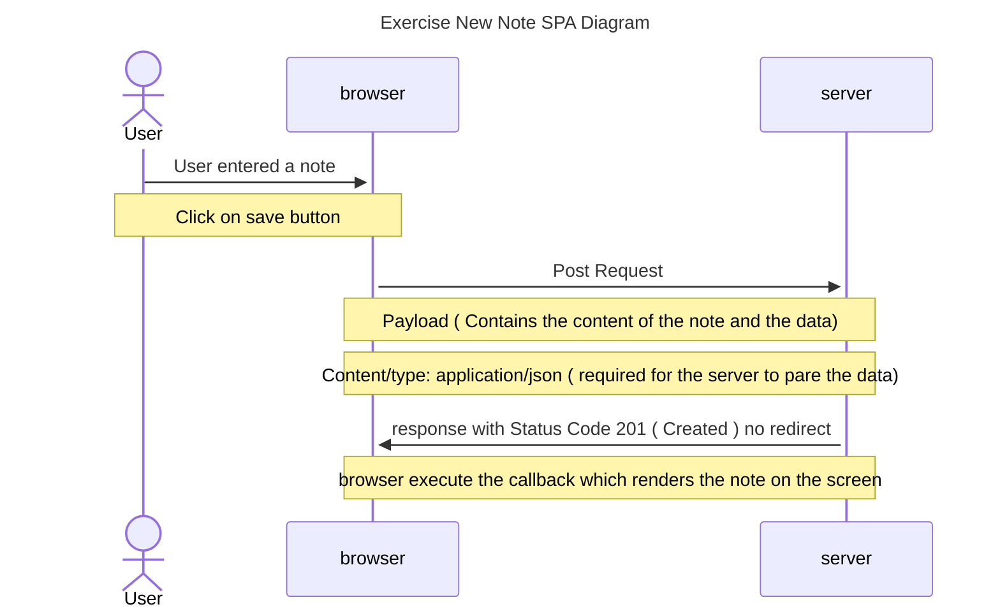

```mermaid
sequenceDiagram
title Exercise New Note SPA Diagram
actor User
participant browser
participant server

    User->>+browser: User entered a note
    Note over User,browser: Click on save button
    browser->>+server: Post Request
    Note over browser,server: Payload ( Contains the content of the note and the data)
    Note over browser,server: Content/type: application/json ( required for the server to pare the data)
    server->>+browser: response with Status Code 201 ( Created ) no redirect
    Note over browser,server: browser execute the callback which renders the note on the screen

```
